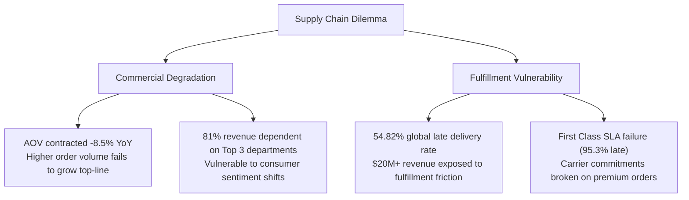
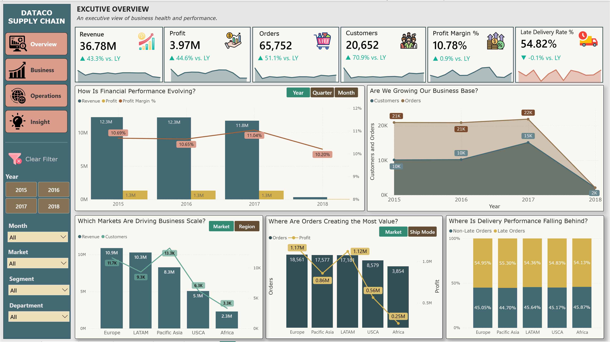
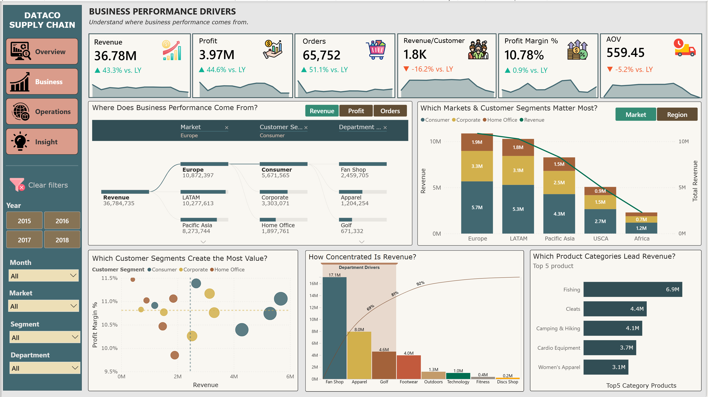
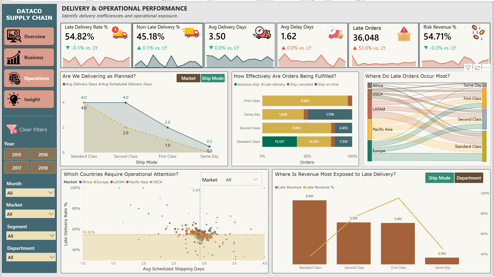
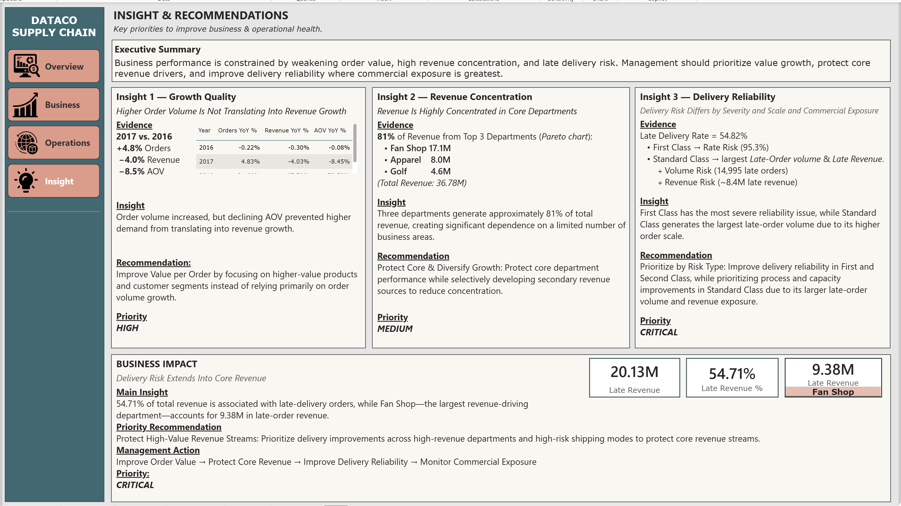
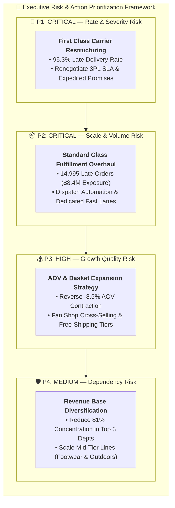
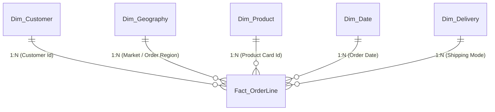

# 🌐 DataCo Smart Supply Chain & Operations Intelligence

[](https://powerbi.microsoft.com/)
[](https://learn.microsoft.com/en-us/dax/)
[](https://learn.microsoft.com/en-us/power-bi/guidance/star-schema)
[]()

> **An enterprise-grade Operations Control Tower dashboard designed for the Chief Operations Officer (COO) to evaluate global supply chain health, resolve late-delivery bottlenecks, address revenue concentration, and restore order profitability.**

---

## 📌 Table of Contents
1. [Executive Summary](#-executive-summary)
2. [Business Problem & Strategic Context](#-business-problem--strategic-context)
3. [Interactive Dashboard Live Demo](#-interactive-dashboard-live-demo)
4. [Dashboard Architecture & Visuals](#-dashboard-architecture--visuals)
5. [In-Depth Business Insights & Evidence](#-in-depth-business-insights--evidence)
6. [Prioritized Recommendations & Strategic Roadmap](#-prioritized-recommendations--strategic-roadmap)
7. [Data Architecture & Star Schema Modeling](#-data-architecture--star-schema-modeling)
8. [Advanced DAX Formulations](#-advanced-dax-formulations)
9. [Repository Structure](#-repository-structure)
10. [How to Reproduce & Open the Project](#-how-to-reproduce--open-the-project)
11. [Author & Contact](#-author--contact)

---

## 🏢 Executive Summary

Global supply chain operations require balancing two competing mandates: **commercial growth** and **operational fulfillment reliability**. When logistics SLAs degrade, customer lifetime value declines and hard-won market share is rapidly eroded.

This project delivers a **comprehensive Operations Control Tower** built for the **Chief Operations Officer (COO)** of DataCo Global. Leveraging an enterprise transactional dataset of **180,519 records** across global territories (LATAM, Europe, USCA, Pacific Asia, Africa), the solution establishes unified visibility across order processing, logistics lead times, delivery fulfillment, and product margin performance.

### 🌟 Headline Findings:
* **Total Business Scale:** **$36.78M Total Revenue** and **$3.98M Profit** across 65,000+ customer orders.
* **The Growth Quality Paradox (2017 vs. 2016):** While order volume grew by **+4.8%**, overall revenue dropped by **−4.0%** because Average Order Value (AOV) plummeted by **−8.5%**.
* **High Revenue Concentration:** **81% of total global revenue** is concentrated in just 3 departments (*Fan Shop $17.1M, Apparel $8.0M, Golf $4.6M*).
* **Delivery Reliability Crisis:** **54.82% of all orders are delivered late**, exposing **54.71% of total gross revenue** (~$20M+) to severe customer dissatisfaction risk.
* **Dual-Risk Logistics Profile:**
  * **Rate Risk (Severity):** *First Class* has a staggering **95.3% late delivery rate**.
  * **Scale Risk (Volume & Commercial Exposure):** *Standard Class* accounts for the largest late-order volume (**14,995 orders**) and the highest late revenue exposure (**~$8.4M**).

---

## 🎯 Business Problem & Strategic Context



### Core Business Questions Answered:
1. *Is company top-line expansion translating into healthy, profitable growth?*
2. *Where do revenue and profitability originate, and how concentrated is commercial risk?*
3. *Which shipping modes and geographic regions represent operational bottlenecks?*
4. *How does delivery delay extend into core commercial revenue streams, and what actions should the executive committee prioritize?*

---

## 🌐 Interactive Dashboard Live Demo

🔗 **[Click Here to Explore the Interactive Dashboard on NovyPro](https://www.novypro.com/)** *(Live Demo Link)*  
*(Experience full interactivity: slice by Market, drill down from Department into Categories, inspect the Sankey supply chain flow, and examine YoY growth scorecards).*

---

## 📊 Dashboard Architecture & Visuals

The report comprises **4 Strategic Pages** and **Dynamic Micro-Interaction Tooltips**:

### 1. Page 1: Executive Overview
* **Purpose:** Strategic executive pulse check connecting macro financial health with operational delivery KPIs.
* **Key Visuals:**
  * **Executive KPI Cards (with YoY Variance):** Revenue, Profit, Profit Margin %, Total Orders, Customers, and Late Delivery Rate %.
  * **Financial Progression Over Time:** Monthly revenue and profit margin trajectory.
  * **Regional Business Scale:** Comparative performance across global markets (LATAM, Europe, USCA, Pacific Asia, Africa).
  * **Delivery Health Indicator:** Overall late delivery rate benchmarked against target SLAs.

*(Insert screenshot: `assets/dashboards/01_Executive_Overview.png`)*


---

### 2. Page 2: Business Performance Drivers
* **Purpose:** Discovering the fundamental drivers of revenue and assessing customer segment dynamics.
* **Key Visuals:**
  * **Pareto Concentration Chart (80/20):** Department cumulative revenue contribution highlighting structural dependence.
  * **Category Leadership Matrix:** Top-performing categories (Cleats, Men's Footwear, Women's Apparel).
  * **Customer Segment Breakdown:** Consumer (52%), Corporate (30%), and Home Office (18%) distribution across markets.

*(Insert screenshot: `assets/dashboards/02_Business_Drivers.png`)*


---

### 3. Page 3: Delivery & Operational Performance
* **Purpose:** Granular inspection of logistics lead times, carrier compliance, and bottleneck isolation.
* **Key Visuals:**
  * **Sankey Supply Chain Flow:** Mapping order flow from Origin Markets $\rightarrow$ Shipping Modes $\rightarrow$ Delivery Fulfillment Status.
  * **Dumbbell Chart (Scheduled vs. Real Days):** Visualizing the variance gap between SLA commitments and physical delivery days.
  * **Late Delivery Exposure by Shipping Mode:** Contrasting rate severity against absolute financial exposure.
  * **Geographic Risk Map:** Pinpointing recipient countries experiencing severe fulfillment lag.

*(Insert screenshot: `assets/dashboards/03_Operations_Delivery.png`)*


---

### 4. Page 4: Strategic Insights & Recommendations
* **Purpose:** Executive decision matrix synthesizing findings into actionable operational workstreams.

*(Insert screenshot: `assets/dashboards/04_Insight_Recommendations.png`)*


---

## 💡 In-Depth Business Insights & Evidence

### 🔍 Insight 1 — Growth Quality: Higher Volume Fails to Translate into Revenue Expansion
* **Evidence (2017 vs. 2016):**
  * Order volume expanded by **+4.8%** (higher processing burden on warehouses).
  * Net Revenue contracted by **−4.0%**.
  * Average Order Value (AOV) declined by **−8.5%**.
* **Analytical Interpretation:** The business is working harder to earn less. Processing more smaller-value baskets escalates fixed pick-and-pack logistics overhead without delivering corresponding top-line expansion.

---

### 🔍 Insight 2 — Revenue Concentration: High Commercial Exposure in Core Departments
* **Evidence (Pareto Analysis):**
  * **Top 3 Departments generate 81.0% of total revenue ($36.78M):**
    1. **Fan Shop:** **$17.1M** (46.5%)
    2. **Apparel:** **$8.0M** (21.7%)
    3. **Golf:** **$4.6M** (12.5%)
* **Analytical Interpretation:** An overwhelming portion of business enterprise value rests on Fan Shop merchandise. Any supply disruption, supplier dispute, or drop in licensing rights immediately threatens corporate solvency.

---

### 🔍 Insight 3 — Delivery Reliability: Stratification Between Severity Risk & Scale Risk
* **Evidence:**
  * Global Late Delivery Rate stands at **54.82%**.
  * **First Class (Rate / Severity Risk):** **95.3% late delivery rate**. Almost zero customer orders arrive within the promised expedited timeframe.
  * **Standard Class (Scale / Financial Risk):** Highest late volume (**14,995 late orders**) carrying **~$8.4M in late revenue exposure**.
* **Analytical Interpretation:** Premium customers who pay extra for First Class shipping experience near-total fulfillment failure (reputation damage), whereas Standard Class represents a massive operational bottleneck draining cash flow.

---

### 🔍 Insight 4 — Business Impact: Delivery Friction Extends into Core Revenue
* **Evidence:**
  * **54.71% of total enterprise revenue** is tied to orders delivered behind schedule.
  * **Fan Shop alone accounts for $9.38M in late revenue exposure.**
* **Analytical Interpretation:** Operational delivery failures are not isolated to fringe products; they are actively threatening relationships with the company's highest-spending customer cohort.

---

## 🚀 Prioritized Recommendations & Strategic Roadmap



| Priority | Strategic Initiative | Action Items | Expected Business Impact |
| :---: | :--- | :--- | :--- |
| **P1 - CRITICAL** | **Logistics SLA Restructuring (First Class)** | Audit external carrier contract agreements; recalibrate scheduled SLA promises from 1–2 days to realistic transit thresholds or replace underperforming 3PL providers. | Eliminate the 95.3% late delivery rate on expedited orders; protect high-margin premium customer satisfaction. |
| **P2 - CRITICAL** | **Standard Class Fulfillment Overhaul** | Optimize warehouse dispatch throughput; establish dedicated fast-tracking lanes for high-volume standard parcels. | Reduce late order volume by 25–30%, safeguarding ~$2.5M in annual repeat business. |
| **P3 - HIGH** | **AOV & Basket Expansion Strategy** | Introduce cross-category bundling (e.g., Fan Shop merchandise paired with Apparel items) and tiered free-shipping minimum thresholds. | Reverse the −8.5% AOV erosion, lifting total revenue without inflating operational unit costs. |
| **P4 - MEDIUM** | **Selective Portfolio Diversification** | Strategically invest marketing and distribution resources into mid-tier departments (Footwear, Outdoors) to de-risk dependency on Fan Shop. | Rebalance revenue concentration so no single department exceeds 35% of total turnover. |

---

## 🏗️ Data Architecture & Star Schema Modeling

The original flat table (180k rows $\times$ 53 columns) was normalized into an enterprise **Star Schema** to ensure high DAX evaluation speed and intuitive report navigation:



### Table Dimensions & Granularity:
* **`Fact_OrderLine`:** 180,519 line items capturing unit quantity, sales, net profit, shipping days (real vs. scheduled), discount rates, and fulfillment status flags.
* **`Dim_Customer`:** Master demographic table covering customer segments (Consumer, Corporate, Home Office), geographic origin, and unique identifiers.
* **`Dim_Geography`:** Standardized geographical hierarchy (*Market $\rightarrow$ Order Region $\rightarrow$ Order Country $\rightarrow$ Order City*).
* **`Dim_Product`:** Merchandising hierarchy (*Department $\rightarrow$ Category $\rightarrow$ Product Name*).
* **`Dim_Delivery`:** Delivery mode specifications (*First Class, Same Day, Second Class, Standard Class*).
* **`Dim_Date`:** Analytical calendar covering years 2015 to 2018 with full fiscal period hierarchies.

---

## 🧮 Advanced DAX Formulations

Below are core samples of the high-performance DAX measures authored for this solution:

### 1. Late Delivery Rate Percentage
```dax
Late Delivery Rate % = 
DIVIDE(
    CALCULATE(
        [Orders],
        'Fact_OrderLine'[Late_delivery_risk] = 1
    ),
    [Orders],
    0
)
```

### 2. Commercial Late Revenue Exposure
```dax
Late Revenue = 
CALCULATE(
    [Revenue],
    'Fact_OrderLine'[Late_delivery_risk] = 1
)

Late Revenue % = 
DIVIDE(
    [Late Revenue],
    [Revenue],
    0
)
```

### 3. Average Delay Days (Conditional Variance)
```dax
Avg Delivery Delay Days = 
AVERAGEX(
    FILTER(
        'Fact_OrderLine',
        'Fact_OrderLine'[Days for shipping (real)] > 'Fact_OrderLine'[Days for shipment (scheduled)]
    ),
    'Fact_OrderLine'[Days for shipping (real)] - 'Fact_OrderLine'[Days for shipment (scheduled)]
)
```

### 4. Year-over-Year (YoY) AOV Growth Percentage
```dax
AOV YoY % = 
VAR _CurrentAOV = [Avg Order Value (AOV)]
VAR _PriorYearAOV = 
    CALCULATE(
        [Avg Order Value (AOV)],
        SAMEPERIODLASTYEAR('Dim_Date'[Date])
    )
RETURN
    DIVIDE(_CurrentAOV - _PriorYearAOV, _PriorYearAOV, 0)
```

### 5. Dynamic YoY Card Label (UI Formatting)
```dax
AOV Label YoY = 
VAR _YoY = [AOV YoY %]
RETURN
    IF(
        ISBLANK(_YoY),
        "- vs LY",
        IF(
            _YoY >= 0,
            "▲ +" & FORMAT(_YoY, "0.0%") & " vs LY",
            "▼ " & FORMAT(_YoY, "0.0%") & " vs LY"
        )
    )
```

---

## 📁 Repository Structure

```
powerbi-dataco-supply-chain-analytics/
├── assets/
│   ├── dashboards/               # High-resolution screenshots of each dashboard page
│   │   ├── 01_Executive_Overview.png
│   │   ├── 02_Business_Drivers.png
│   │   ├── 03_Operations_Delivery.png
│   │   └── 04_Insight_Recommendations.png
│   ├── icons/                    # Custom UI icons for navigation and KPI cards
│   └── model/                    # Star Schema diagram screenshots
├── data/
│   ├── data_dictionary.md        # Comprehensive data dictionary and metadata
│   ├── DescriptionDataCoSupplyChain.csv # Column mapping specifications
│   └── sample_DataCoSupplyChainDataset.csv # 1,000-row sample for schema preview
├── docs/
│   ├── design_thinking_framework.md # 5W1H, COO Empathy map, and Dual Northstars
│   ├── Design Thinking_DataCoSupplyChain.xlsx # Original Design Thinking workbook
│   └── PowerBI - Final Project (Project 4).docx # Academic project brief
├── pbix/
│   └── DataCo_Supply_Chain_Operations_Analytics.pbix # Official Final Power BI report
├── .gitignore                    # Excludes 90MB+ raw CSVs, temporary files, and backups
└── README.md                     # Executive portfolio documentation
```

---

## 💻 How to Reproduce & Open the Project

1. **Clone this repository:**
   ```bash
   git clone https://github.com/<your-username>/powerbi-dataco-supply-chain-analytics.git
   ```
2. **Download full raw dataset (if refreshing data model):**
   * The complete 96MB raw transactional CSV can be downloaded from [Kaggle: DataCo Smart Supply Chain Dataset](https://www.kaggle.com/datasets/shashwatwork/dataco-smart-supply-chain-for-big-data-analysis).
   * Place `DataCoSupplyChainDataset.csv` into the `data/` folder.
3. **Open the report:**
   * Open `pbix/DataCo_Supply_Chain_Operations_Analytics.pbix` in [Power BI Desktop](https://powerbi.microsoft.com/desktop/).
   * Update the file path in **Transform Data $\rightarrow$ Data source settings** if prompted.

---

## 👤 Author & Contact

* **Author:** **Nguyễn Xuân Thu**
* **Role:** Data Analyst (Specializing in Operations Analytics, Supply Chain Intelligence & BI)
* **Email:** *[your-email@example.com]*
* **LinkedIn:** *[https://linkedin.com/in/your-profile]*
* **GitHub:** *[https://github.com/your-username]*

---
*⭐ If you find this project valuable for your supply chain analysis or evaluation, please consider starring the repository!*
