# 📖 Data Dictionary - DataCo Smart Supply Chain Analytics

This document details the analytical schema, dimensional model (Star Schema), and column specifications for the **DataCo Smart Supply Chain & Operations Analytics** project.

---

## 🏗️ Data Architecture: Star Schema Model

The raw dataset of **180,519 transactions** and 53 columns has been transformed into a clean, performant **Star Schema** with **1 Fact Table** and **5 Dimension Tables**.

```mermaid
erDiagram
    Dim_Customer ||--o{ Fact_OrderLine : "1 to Many (Customer Id)"
    Dim_Geography ||--o{ Fact_OrderLine : "1 to Many (Order Region / City)"
    Dim_Product ||--o{ Fact_OrderLine : "1 to Many (Product Card Id)"
    Dim_Date ||--o{ Fact_OrderLine : "1 to Many (Order Date)"
    Dim_Delivery ||--o{ Fact_OrderLine : "1 to Many (Shipping Mode)"

    Fact_OrderLine {
        int Order_Id PK "Mã đơn hàng định danh"
        int Order_Item_Id PK "Mã từng mặt hàng trong đơn"
        date Order_Date FK "Ngày đặt hàng (liên kết Dim_Date)"
        date Shipping_Date "Ngày vận chuyển thực tế"
        int Customer_Id FK "Mã khách hàng (liên kết Dim_Customer)"
        int Product_Card_Id FK "Mã sản phẩm (liên kết Dim_Product)"
        string Shipping_Mode FK "Phương thức vận chuyển (liên kết Dim_Delivery)"
        decimal Sales "Doanh số thực tế ghi nhận sau chiết khấu"
        decimal Order_Item_Total "Tổng giá trị dòng sản phẩm"
        decimal Order_Profit "Lợi nhuận ròng trên từng dòng đơn"
        decimal Order_Item_Discount "Số tiền giảm giá / chiết khấu"
        decimal Order_Item_Discount_Rate "Tỷ lệ phần trăm giảm giá"
        int Order_Item_Quantity "Số lượng sản phẩm đặt"
        int Days_for_shipping_real "Số ngày vận chuyển thực tế"
        int Days_for_shipment_scheduled "Số ngày giao hàng cam kết"
        string Delivery_Status "Trạng thái giao hàng (Late, Advance, On Time, Canceled)"
        int Late_delivery_risk "Cờ cảnh báo giao trễ (1: Trễ, 0: Đúng hạn)"
        string Order_Status "Trạng thái đơn (COMPLETE, PROCESSING, PENDING...)"
    }

    Dim_Customer {
        int Customer_Id PK "Mã khách hàng duy nhất"
        string Customer_Name "Họ và tên khách hàng"
        string Customer_Segment "Phân khúc (Consumer, Corporate, Home Office)"
        string Customer_City "Thành phố cư trú của khách hàng"
        string Customer_State "Bang cư trú của khách hàng"
        string Customer_Country "Quốc gia khách hàng"
    }

    Dim_Geography {
        string Market PK "Thị trường lớn (Europe, LATAM, USCA, Pacific Asia, Africa)"
        string Order_Region "Khu vực giao dịch chi tiết (Southeast Asia, Western Europe...)"
        string Order_Country "Quốc gia nhận hàng"
        string Order_City "Thành phố nhận hàng"
        string Order_State "Bang nhận hàng"
    }

    Dim_Product {
        int Product_Card_Id PK "Mã sản phẩm duy nhất"
        string Product_Name "Tên sản phẩm thương mại"
        int Product_Category_Id "Mã danh mục sản phẩm"
        string Category_Name "Tên danh mục (Cleats, Men's Footwear, Women's Apparel...)"
        int Department_Id "Mã phòng ban / ngành hàng"
        string Department_Name "Ngành hàng lớn (Fan Shop, Apparel, Golf, Footwear...)"
        decimal Product_Price "Giá niêm yết của sản phẩm"
        string Product_Status "Trạng thái lưu kho (Available / Out of Stock)"
    }

    Dim_Delivery {
        string Shipping_Mode PK "Phương thức vận chuyển (Standard Class, First Class, Second Class, Same Day)"
        string Delivery_SLA_Tier "Cấp độ dịch vụ cam kết"
    }

    Dim_Date {
        date Date PK "Ngày chuẩn định dạng YYYY-MM-DD"
        int Year "Năm (2015, 2016, 2017, 2018)"
        int Quarter "Quý (1-4)"
        int Month "Tháng (1-12)"
        string Month_Name "Tên tháng"
        int Day "Ngày trong tháng (1-31)"
    }
```

---

## 📋 Chi tiết các thuộc tính chính

| Thuộc tính | Kiểu dữ liệu | Ý nghĩa nghiệp vụ |
| :--- | :--- | :--- |
| `Sales` | Decimal | Doanh thu thực tế của từng dòng đơn sau khi trừ chiết khấu. |
| `Order Profit` | Decimal | Lợi nhuận gộp sinh ra từ từng dòng sản phẩm bán ra. |
| `Profit Margin %` | Percentage | Tỷ suất lợi nhuận trên doanh thu: `[Profit] / [Revenue]`. |
| `Days for shipping (real)` | Integer | Số ngày thực tế đội ngũ logistics mất để giao kiện hàng. |
| `Days for shipment (scheduled)` | Integer | Số ngày cam kết theo SLA của từng loại hình vận chuyển. |
| `Delivery Status` | String | Trạng thái: **Late delivery** (Giao trễ), **Advance shipping** (Giao sớm), **Shipping on time** (Đúng hạn), **Shipping canceled** (Hủy giao). |
| `Late_delivery_risk` | Binary (0/1) | Biến phân loại: 1 nếu thời gian giao hàng thực tế vượt quá cam kết. |
| `Market` | String | Phân vùng thị trường quốc tế: **LATAM**, **Europe**, **Pacific Asia**, **USCA**, **Africa**. |
| `Department Name` | String | Nhóm ngành hàng lớn quản lý danh mục sản phẩm. |
| `Customer Segment` | String | Nhóm khách hàng: **Consumer** (Cá nhân), **Corporate** (Doanh nghiệp), **Home Office** (Văn phòng gia đình). |
