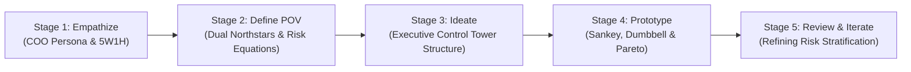

# 🧠 Design Thinking Framework: DataCo Smart Supply Chain Analytics

This document details the **User-Centric Design Thinking Framework** applied to architect the **DataCo Smart Supply Chain & Operations Intelligence Dashboard**.

---

---

## 🎯 Stage 1: Empathize (Thấu cảm người dùng)

### 1. Phân tích 5W1H
* **Who (Key Stakeholder):** **Chief Operations Officer (COO)**.
  * *Trách nhiệm:* Quản lý và tối ưu hóa toàn bộ hoạt động chuỗi cung ứng toàn cầu, từ xử lý đơn hàng, điều phối kho bãi đến vận chuyển chặng cuối (Last-Mile Delivery), đồng thời đảm bảo bảo toàn biên lợi nhuận và trải nghiệm khách hàng.
* **What (Vấn đề cần giải quyết):**
  * Tỷ lệ đơn hàng giao trễ vượt ngưỡng báo động (**> 50%**), gây ảnh hưởng nghiêm trọng đến trải nghiệm khách hàng và uy tín thương hiệu.
  * Nghịch lý tăng trưởng: Doanh thu suy giảm dù tổng sản lượng đơn hàng tăng lên.
  * Thiếu cái nhìn tổng thể thống nhất (Single Source of Truth) giữa phòng ban Kinh doanh (Sales) và Vận hành (Logistics).
* **When & Where:** Được sử dụng hàng tuần trong cuộc họp giao ban vận hành (Weekly Operations Review) và định kỳ hàng tháng/quý để điều chỉnh kế hoạch điều phối cung ứng.
* **Why:** Xác định chính xác khâu vận hành nào đang là điểm nghẽn (Bottleneck), phương thức vận chuyển nào gây rủi ro cao nhất, và ngành hàng nào đang chịu tổn thất doanh thu lớn nhất do giao hàng trễ.
* **How:** Xây dựng một Tháp điều khiển vận hành (**Operations Control Tower**) cho phép phân tầng từ bức tranh tài chính vĩ mô xuống sâu từng thị trường, phương thức vận chuyển và danh mục sản phẩm.

### 2. Empathy Map (Bản đồ thấu cảm)
* **Suy nghĩ & Cảm xúc (Thinking & Feeling):**
  * *"Doanh thu đang tăng ở một số thị trường, nhưng lợi nhuận thực tế có tăng không?"*
  * *"Tại sao khách hàng phàn nàn về việc giao trễ ngày càng nhiều dù chi phí logistics không ngừng tăng?"*
  * *"Nguồn lực kho bãi và đối tác vận tải đang được phân bổ đúng chỗ chưa?"*
* **Lời nói & Hành động (Saying & Doing):**
  * Nhận báo cáo rời rạc từ các giám đốc khu vực nhưng không thể đối chiếu chéo.
  * Thường xuyên phải "chữa cháy" khi các đơn hàng cao cấp (First Class) bị trễ cam kết.
* **Nỗi đau (Pains):**
  * Hơn 54% doanh thu công ty đang bị gắn liền với đơn hàng bị giao trễ.
  * Không phân biệt được giữa **rủi ro về tỷ lệ (Rate Risk)** và **rủi ro về quy mô doanh thu (Volume/Revenue Exposure Risk)**.
* **Lợi ích mong đợi (Gains):**
  * Một Dashboard thời gian thực tập trung tất cả KPIs kinh doanh & vận hành.
  * Phát hiện sớm các bất thường trong chuỗi cung ứng trước khi chúng gây tổn thất tài chính.

---

## 🧭 Stage 2: Define Point of View (Góc nhìn & Northstar)

### 1. Hệ thống chỉ số Bắc Đẩu kép (Dual Northstar Metrics)
* **Northstar 1 (Hiệu quả Kinh doanh - Commercial Health):** **Net Revenue & Profit Margin %**
  * *Mục tiêu:* Đảm bảo doanh nghiệp duy trì sức khỏe tài chính và chất lượng tăng trưởng bền vững.
* **Northstar 2 (Hiệu quả Vận hành - Operational Reliability):** **On-Time Delivery Rate % / Late Delivery Rate %**
  * *Mục tiêu:* Kiểm soát SLA giao vận, bảo vệ uy tín thương hiệu và giảm thiểu rủi ro churn của khách hàng.

### 2. Công thức tăng trưởng & Rủi ro (Growth & Risk Equations)
$$\text{Revenue} = \text{Orders} \times \text{Average Order Value (AOV)}$$
$$\text{Total Late Revenue} = \sum (\text{Orders}_{\text{Late}} \times \text{AOV}_{\text{Late}})$$
$$\text{Late Delivery Exposure \%} = \frac{\text{Late Revenue}}{\text{Total Revenue}}$$

---

## 💡 Stage 3: Ideate (Cấu trúc thông tin phân tầng)

Dashboard được thiết kế theo cấu trúc **4 Trang Chuyên biệt**:

* **Page 1: Executive Overview (Bức tranh toàn cảnh):**
  * Đo lường sức khỏe tài chính & vận hành tổng thể (Revenue, Profit, Orders, Late Delivery Rate).
  * Đánh giá chất lượng tăng trưởng thông qua so sánh cùng kỳ (YoY).
* **Page 2: Business Performance Drivers (Động lực kinh doanh):**
  * Phân tích Pareto 80/20 mức độ tập trung doanh thu theo ngành hàng (Department).
  * Ma trận phân khúc khách hàng (Consumer vs Corporate vs Home Office) trên từng thị trường lớn.
* **Page 3: Delivery & Operational Performance (Hiệu suất vận hành):**
  * Đối chiếu thời gian giao hàng thực tế vs cam kết (Actual vs Scheduled Shipping Days).
  * Phân tích rủi ro theo phương thức vận chuyển (First Class, Second Class, Standard Class, Same Day).
  * Bản đồ nhiệt rủi ro theo quốc gia nhận hàng (Order Country Exposure).
* **Page 4: Strategic Insights & Recommendations (Đề xuất hành động):**
  * Đúc kết 3 vấn đề then chốt: **Chất lượng tăng trưởng (Growth Quality)**, **Mức độ tập trung (Revenue Concentration)**, và **Độ tin cậy giao hàng (Delivery Reliability)**.

---

## 🎨 Stage 4 & 5: Prototype & Iterative Review

### Lựa chọn Visuals chuyên sâu phục vụ mục tiêu trực quan:
1. **Sankey Diagram:** Trực quan hóa luồng chuỗi cung ứng từ Thị trường nguồn $\rightarrow$ Phương thức vận chuyển $\rightarrow$ Trạng thái giao hàng (On-Time / Late / Canceled).
2. **Dumbbell Chart:** So sánh trực diện khoảng cách giữa ngày giao hàng dự kiến (Scheduled) và ngày giao thực tế (Real) trên từng phương thức.
3. **Pareto Chart Pro:** Chứng minh quy luật 80/20 về mức độ phụ thuộc doanh thu vào 3 ngành hàng lớn (Fan Shop, Apparel, Golf).
4. **Custom Dynamic Tooltips:** Cho phép hover vào bất kỳ danh mục hoặc thị trường nào để xem cơ cấu rủi ro chi tiết mà không làm tràn dữ liệu trên trang chính.
